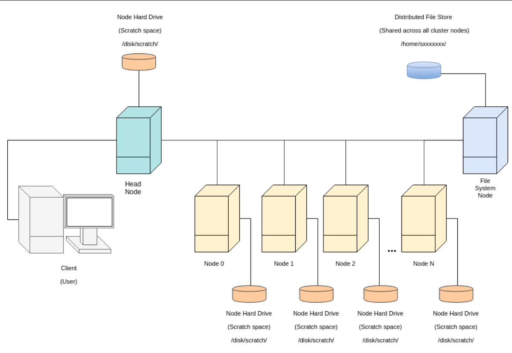

# Using UNIMI INDACO for Machine Learning: Quick Start
## 15 June 2023
### Manuel Dileo (adapted from Tom Sherborn, University of Edinburgh)

This guide explains how to:
 - Log on to the cluster
 - Set up a conda environment manager
 - Provides examples of
	 - Interactive sessions with and without a GPU (srun)
	 - Running scripts on the cluster non-interactively (batch)
 
 ## Disclaimer
 This quick start is strongly related to running machine learning experiments and it is not official. For official user guides, you can refer to the [INDACO website](https://www.indaco.unimi.it/index.php/documentazione/).

 ## Log on to INDACO
You can SSH into INDACO without using a VPN. To do so, you can use the command
```
ssh -L 5000:127.0.0.1:3389 name.surname@login.indaco.unimi.it
```
For the rest of the guide, we will just use shell commands. If you are not comfortable with shells you can read this [MIT guide](https://missing.csail.mit.edu/).

## Important things to note first


This is an approximate setup of how INDACO is arranged.

- The initial node you log into is called the __head node__ - __do not__ run heavy processes on here. This node is only used for sending jobs to other nodes in the cluster
- The filesystem you have access to when you log in is identical on all the nodes you can access - it is a __distributed__ filesystem. As such, it is very slow (because it must appear the same everywhere)!
    - Avoid reading and writing files frequently on this filesystem
    - Instead, when running a job on a node, use its scratch disk and only move files to the shared filesystem infrequently. The scratch disk is located at `/disk/scratch` normally.
- Please skim-read this for best practice: http://computing.help.inf.ed.ac.uk/cluster-tips

## Project directory organization
The home directory provides a limited space of 10GB. In the home directory, you can not install any new software. To be able to setup a conda environment and install new software, move to the directory of your project with
```
cd ${projectname}
```
On the project directory user have access to three different storage area:
- A scratch area that can be used as a temporary area. Upon request, INDACO staff can delete its content periodically.
- A backup area that holds a replica of the data already present in other systems external to Indaco. Please take a look at the README available in the related folder.
- A project area

## Environment modules
Indaco provides several modules to allow the user to prepare the computing environment according to the application, library, or development tool s/he intends to use. 

The ```module avail``` command provides the list of all the available modules. The ```module load ${name}``` command allows you to load the specified module. 

To run ML experiments with PyTorch we need to load at least the following modules:
```
module load python3/anaconda/3-2022
module load CUDA/11.7
module load intel/parallel_2020
```

## Setup a conda environment with PyTorch

1. Let's define where the pkgs should be written
```
mkdir -p /gpfs/home/projects/${projectname}/folder/pkg
```
2. Configure conda to use the new folder
```
conda config --add pkgs_dirs /gpfs/home/projects/${projectname}/folder/pkg
```
3. Create the environment
```
conda create –p ~/${projectname}/folder/pkg/mypt
```
4. Activate the environment
```
conda activate ~/${projectname}/folder/pkg/mypt
```
5. Install pytorch (or any other package)
```
conda install pytorch torchvision torchaudio pytorch-cuda=11.7 -c pytorch -c nvidia
```
## What's Next? Practical examples!
INDACO is managed by the [slurm](https://slurm.schedmd.com/documentation.html) job scheduler. All the examples below are based on slurm commands. All the examples below expect you have performed the prior setup.

#### Get some code to run mnist experiments.
Get some code to run mnist in pytorch and run it:
 - `mkdir ~/${projectname}/projects`
 - `cd ~/${projectname}/projects` 
 - `git clone https://github.com/pytorch/examples.git`

##### Interactive jobs (without a GPU)
1. Get an interactive session (you shouldn’t do processing on the head node)
     - Find partitions on the INDACO clusters. For example:
     ```
    $ sinfo -o '%R;%N;%l' | column -s';' -t
    > PARTITION          NODELIST                           TIMELIMIT
    > light              light[1-12]                        5-01:00:00
    > …
     ```
     - Use srun to get an interactive session on that partition. For example: 
     ```
    srun --partition=light --time=08:00:00 --mem=8000 --cpus-per-task=4 --pty bash
    ```
2. Run example MNIST code:
    - `cd ~/${projectname}/projects/examples/mnist`
    - `conda activate ~/${projectname}/folder/pkg/mypt`
    - `python main.py`

Please note: this is going to download data to the Distributed Filesystem (i.e. in your current working directory) and the code will access the data from there: this is not good practice on this cluster (because it will be very slow) - best practice says to store and access data in the scratch space of the node you’re running on

3. Exit your interactive session by running `exit`

##### Interactive jobs (with GPUs)
1. Launch a similar `srun` command using the `gres` command to request a GPU in your job:
    ```
    srun --partition=gpu --time=08:00:00 --mem=14000 --cpus-per-task=4 --gres=gpu:1 --pty bash
    ```
    Note that you should be registered as user with access to partition with GPUs.
2. Run example MNIST code:
    - `cd ~/${projectname}/projects/examples/mnist`
    - `conda activate ~/${projectname}/folder/pkg/mypt`
    - `python main.py`

3. Exit your interactive session by running `exit`

##### Batch Jobs (non-interactive)

Repeat the above but this time using an sbatch script (non-interactive session). The command `sbatch` has many of the same arguments as `srun`, for example, add `--gres=gpu:1` if you would like to use one gpu

- `cd ~/${projectname}/projects/examples/mnist`
- create a bash script, `mnist_expt.sh`, for slurm to run:
    ```
    #!/usr/bin/env bash
    conda activate ~/${projectname}/folder/pkg/mypt
    python main.py
    ```
 - Run this script by running: `sbatch --time=08:00:00 --mem=14000 --cpus-per-task=4 --gres=gpu:1 mnist_expt.sh`
 - Observe your job running with: `squeue -u ${name.surname}` 
 - You can get information about your jobs with `sinfo -u ${name.surname}`
 - Check out the log file with `cat slurm-*.out`. This will be in the working directory you were inside when you ran the `sbatch` command.

#### Array jobs

We provide a python script to generate slurm array jobs to conduct a grid search hyperparameter tuning on MNIST pytorch example. To generate the array job script run the following commands:
- `cd ~/${projectname}/projects/examples/mnist`
- `python gridsearch_slurm_jobs.py > gridsearch_mnist.sh`
- `chmod +x gridsearch_mnist.sh`
- `sbatch gridsearch_mnist.sh`

## Useful Documentation and Links
```
projectstatus ${projectname}
```
provides how many hours you consumed
### INDACO support
 - Main page: https://www.indaco.unimi.it/
 - User guides: https://www.indaco.unimi.it/index.php/documentazione/
 - Ticket support: https://www.indaco.unimi.it/index.php/supporto/
### Slurm docs
 - Quick start: https://slurm.schedmd.com/quickstart.html
 - sbatch: https://slurm.schedmd.com/sbatch.html
 - srun: https://slurm.schedmd.com/srun.html
 - array jobs: https://slurm.schedmd.com/job_array.html
